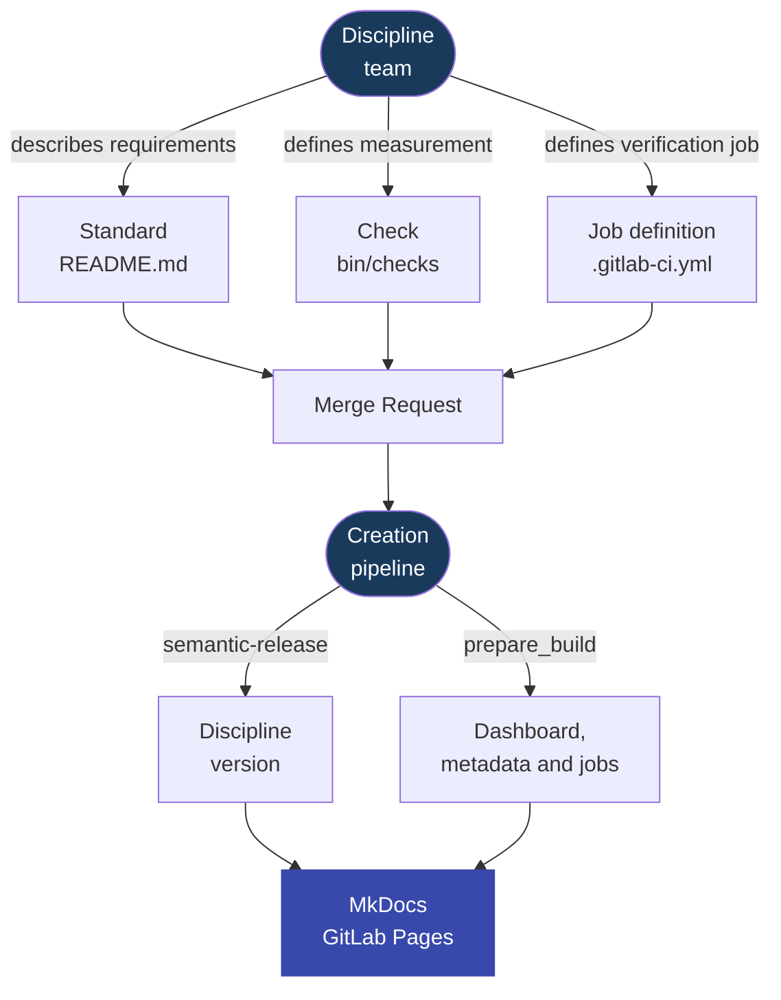

---
tags:
  - documentation
  - creative process
---

# Standards Creation Process Idea

The creation process describes how the discipline team turns organizational requirements into a versioned product: standards, documentation, and ready verification jobs. The result is not only a descriptive page. The result is a released discipline version that development teams can point to in `discipline.yaml` and measure in their pipelines.

The most important rule of the process is simple:

- the standard describes **what** must be met,
- the check describes **how** it will be measured,
- the discipline version says **since when** the rule applies.



## 1. Creating a Standard

The discipline team creates a standard in the directory:

```text
standards/{domain}/STD-XXX-YYY/
```

The domain list is maintained in `standards/domain.json`. A new domain can be created with the generator:

```bash
bin/tools/discipline_create_domain repozytorium REPO
```

The generator adds the domain to the registry and creates the `standards/{domain}` directory.

A new standard skeleton can be created with:

```bash
bin/tools/discipline_create_standard \
  repozytorium \
  "Standard name"
```

The generator reads the domain `gid`, assigns the next `STD-{GID}-{NNN}` identifier, creates `README.md`, `bin/checks`, and `.gitlab-ci.yml`, and then adds the standard page to `mkdocs.yml`.

The standard identifier is stable. Once assigned, it should not change, even if the standard is later clarified, replaced, or withdrawn.

The primary standard file is `README.md`. This is where the team describes requirements, context, and how to interpret the standard. Normative requirements should be written using [BCP 14](https://datatracker.ietf.org/doc/rfc2119/) language:

- `MUST` for mandatory requirements,
- `SHOULD` for recommended requirements,
- `MAY` for permitted behaviors.

The normative description should be tool-independent. The standard should not only say "use a specific script"; it should describe the expected state. Tools, examples, and measurement implementation are the execution part of the standard.

## 2. Defining the Measurement

If the standard is to be measured automatically, the discipline team adds a check, most often as:

```text
standards/{domain}/STD-XXX-YYY/bin/checks
```

The check can measure compliance in any way justified by the standard. It can check files in the repository, GitLab configuration, the result of another tool, attestations in `discipline.yaml`, CI artifacts, or external APIs.

The process does not impose a closed list of verification types. The contract matters:

- the check must measure the requirement described in the standard,
- the result must be processable by the pipeline,
- a measurement error should not pretend to be compliance,
- the log should help the development team understand what needs to be fixed.

In practice, the standard job writes the result of a single measurement as:

```text
results/{STD_ID}.json
```

The minimal result has this form:

```json
{"key":"STD-REPO-001","status":"pass"}
```

Allowed statuses for a single standard are `pass`, `fail`, and `waived`.

## 3. Adding the Verification Job Definition

The `bin/checks` script alone is not enough, because the pipeline must also know when and how to run it. Therefore each standard should have its own GitLab CI job defined in:

```text
standards/{domain}/STD-XXX-YYY/.gitlab-ci.yml
```

The rule is intentionally simple:

```text
one standard = one job
```

This file does not define the content of the standard. It is the definition of the verification job that will be used later in the verification process. It describes how to execute the measurement in GitLab CI: image, variables, standard identifier, and the command that runs the check.

!!! info "Why a custom job definition?"
    The idea of a custom job definition comes from the fact that different standards can require different tools and different pipeline flows. One standard may need only a Bash shell, another a GitLab API client, another a Python interpreter, security tools, or the earlier result of another standard. Therefore the process does not assume one rigid way to run checks hardcoded in code.

    The job definition gives the standard control over the measurement environment. The standard can choose the image, variables, commands, and dependencies needed for correct verification. The verification pipeline remains an aggregator of results, not a place where special cases must be added for each standard.

The job sets the standard identifier and runs the correct `bin/checks` script. This lets the verification pipeline later collect the results of all standards without knowing their internal implementation.

Example job responsibility:

```yaml
---
👁️ Eye discipline:STD-REPO-001:
  image: registry.gitlab.com/dev.rachuna/artifacts/containers/python:1.2.1
  extends:
    - .dyscypline
  variables:
    STD_DOMAIN: repozytorium
    STD_ID: STD-REPO-001
    DOCS_MD_FILE_PATH: standards/repozytorium/STD-REPO-001/README.md
    STD_CHECK_SCRIPT: /tmp/discipline/standards/$STD_DOMAIN/$STD_ID/bin/checks
  script:
    - |
      if [ ! -f "$STD_CHECK_SCRIPT" ]; then
        echo "Standard check script not found: $STD_CHECK_SCRIPT"
        exit 120
      fi

      bash "$STD_CHECK_SCRIPT"
  allow_failure:
    exit_codes:
      - 101
      - 120

```

The list of jobs published for the verification process is generated automatically by:

```bash
bin/creative_process/discipline_generate_checks_jobs
```

The generator reads files:

```text
standards/**/.gitlab-ci.yml
```

and refreshes:

```text
ci/gitlab/verify/cheks_jobs.yml
```

## 4. Standard Review

A standard change goes through a Merge Request. The review should answer four questions:

| Question | Why It Matters |
| --- | --- |
| Is the requirement unambiguous? | The development team must know what the standard expects. |
| Can the requirement be verified? | A standard without measurement quickly becomes a declaration without control. |
| Does the check measure the same thing the standard describes? | Measurement cannot check something different from the law it enforces. |
| Is the impact of the change correctly described by the commit? | `semantic-release` calculates the version from Conventional Commits. |

A new mandatory standard or a stricter existing requirement has a real impact on application repositories. Development teams will have to meet the requirement or report a temporary exception with an owner, reason, and expiration date.

## 5. Version Decision

The discipline version is calculated by `semantic-release` based on Conventional Commits. Therefore the commit description is part of the creation process, not only a technical format.

Indicative impact interpretation:

| Change | Semver Impact |
| --- | --- |
| clarifying the description without changing requirements | `patch` |
| adding a new standard or new measurement | `minor` |
| tightening a requirement that affects existing consumers | `major` or a consciously planned `minor` |
| changing the `discipline.yaml` format | `major` |
| removing or replacing an active standard | `major` |

Semver has practical meaning here: development teams pin the version in `discipline.yaml`, so a discipline update is explicitly visible in their repository.

## 6. Preparing Version Artifacts

The creation pipeline runs:

```bash
bin/prepare_build
```

`bin/prepare_build` is the process orchestrator. The actual logic is split into smaller steps in `bin/creative_process/`:

| Step | Responsibility |
| --- | --- |
| `bin/reporting_process/discipline_generate_dashboard` | feeds `docs/dashboard.md` and dashboard subpages with data from the GitLab API, rendering the result from Jinja2 templates |
| `bin/creative_process/stamp_standard_metadata` | updates `since:` and `tags: [domain, version]` in standards |
| `bin/creative_process/generate_checks_jobs` | refreshes `ci/gitlab/verify/cheks_jobs.yml` |
| `bin/commit_build_changes` | common script that records and pushes changes if anything actually changed |

The scripts prepare version-dependent files:

- update `since:` in standards,
- update `tags: [domain, version]`,
- update `docs/dashboard.md` and `docs/dashboard/**` subpages if the dashboard generator has data to write,
- run `bin/creative_process/generate_checks_jobs`,
- commit changes only if something actually changed.

The `since:` field says from which discipline version the standard applies. Assigning it in CI reduces manual errors: the standard receives the version resulting from the actual release, not from the Merge Request author's prediction.

This stage also feeds the portal dashboard. It is not a separate decision process: the dashboard generator only fetches data from the GitLab API and writes a Markdown view that MkDocs publishes later.

If the repository contains a generated `docs/dashboard.md` and detail subpages, the MkDocs build includes them in the portal as regular documentation pages. The creation process does not calculate project compliance, but publishes the current dashboard view together with the documentation.

Changes generated by `prepare_build` are committed with the message:

```text
chore(standards): Assign versions to changed standards or update dashboard
```

A dashboard update does not have to bump the discipline version. It is a portal view change, not a change to standards, checks, or the `discipline.yaml` contract.

!!! warning "The dashboard is a view"
    The dashboard published in the portal is as current as the data available when `prepare_build` runs. The dashboard generator does not run standard checks and does not create `conformance.json`; it only looks for existing declarations and application pipeline artifacts.

## 7. Publishing a Version

Version publishing is split into two steps:

1. `semantic-release` publishes the release and the `vX.Y.Z` tag.
2. The tag pipeline builds the MkDocs portal and publishes documentation through GitLab Pages.

From this point on, the discipline version is a product that application repositories can consume. The development team can update:

```yaml
spec:
  discipline:
    ref: X.Y.Z
```

After changing `spec.discipline.ref`, the application pipeline measures compliance against the new standards version.

!!! note
    Key distinction:

    - The standard is the **law**: it describes what must be met.
    - The check is the **measurement**: it verifies whether the law is followed.
    - The release is the **product**: it closes standards and measurements in a specific version.

    A law change without a measurement update creates a dead standard. Measurement without a described law creates an incomprehensible quality gate.
