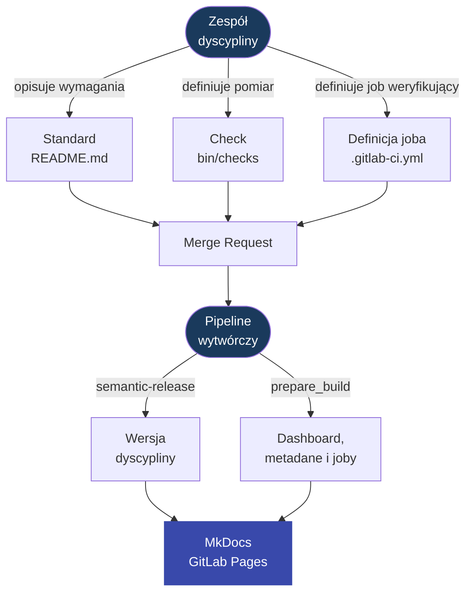

---
tags:
  - documentation
  - creative process
---

# Idea procesu wytwórczego standardów

Proces wytwórczy opisuje, jak zespół dyscypliny zamienia wymagania organizacji w wersjonowany produkt: standardy, dokumentację i gotowe joby weryfikacyjne. Efektem nie jest tylko strona opisowa. Efektem jest wydana wersja dyscypliny, którą zespoły developerskie mogą wskazać w `discipline.yaml` i mierzyć w swoich pipeline'ach.

Najważniejsza zasada procesu jest prosta:

- standard opisuje, **co** musi być spełnione,
- check opisuje, **jak** to zostanie zmierzone,
- wersja dyscypliny mówi, **od kiedy** dana zasada obowiązuje.



## 1. Utworzenie standardu

Zespół dyscypliny tworzy standard w katalogu:

```text
standards/{domena}/STD-XXX-YYY/
```

Lista domen jest utrzymywana w `standards/domain.json`. Nową domenę można utworzyć generatorem:

```bash
bin/tools/discipline_create_domain repozytorium REPO
```

Generator dopisuje domenę do rejestru i tworzy katalog `standards/{domena}`.

Szkielet nowego standardu można utworzyć poleceniem:

```bash
bin/tools/discipline_create_standard \
  repozytorium \
  "Nazwa standardu"
```

Generator odczytuje `gid` domeny, nadaje kolejny identyfikator `STD-{GID}-{NNN}`, tworzy `README.md`, `bin/checks` i `.gitlab-ci.yml`, a następnie dopisuje stronę standardu do `mkdocs.yml`.

Identyfikator standardu jest trwały. Raz nadany nie powinien się zmieniać, nawet jeżeli standard zostanie później doprecyzowany, zastąpiony albo wycofany.

Podstawowym plikiem standardu jest `README.md`. To w nim zespół opisuje wymagania, kontekst i sposób interpretacji standardu. Wymagania normatywne powinny być pisane językiem [BCP 14](https://datatracker.ietf.org/doc/rfc2119/):

- `MUSI` dla wymagań obowiązkowych,
- `POWINIEN` dla wymagań rekomendowanych,
- `MOŻE` dla zachowań dopuszczalnych.

Opis normatywny powinien być niezależny od narzędzi. Standard nie powinien mówić wyłącznie “użyj konkretnego skryptu”, tylko opisywać oczekiwany stan. Narzędzia, przykłady i implementacja pomiaru są częścią wykonawczą standardu.

## 2. Zdefiniowanie pomiaru

Jeżeli standard ma być mierzony automatycznie, zespół dyscypliny dodaje check, najczęściej jako:

```text
standards/{domena}/STD-XXX-YYY/bin/checks
```

Check może mierzyć zgodność w dowolny sposób, który jest uzasadniony przez standard. Może sprawdzać pliki w repozytorium, konfigurację GitLaba, wynik innego narzędzia, atestacje w `discipline.yaml`, artefakty CI albo zewnętrzne API.

Proces nie narzuca zamkniętej listy typów weryfikacji. Ważny jest kontrakt:

- check musi mierzyć wymaganie opisane w standardzie,
- wynik musi być możliwy do przetworzenia przez pipeline,
- błąd pomiaru nie powinien udawać zgodności,
- log powinien pomagać zespołowi developerskiemu zrozumieć, co trzeba poprawić.

W praktyce job standardu zapisuje wynik pojedynczego pomiaru jako:

```text
results/{STD_ID}.json
```

Minimalny wynik ma postać:

```json
{"key":"STD-REPO-001","status":"pass"}
```

Dopuszczalne statusy pojedynczego standardu to `pass`, `fail` i `waived`.

## 3. Dodanie definicji joba weryfikującego

Sam skrypt `bin/checks` nie wystarczy, bo pipeline musi jeszcze wiedzieć, kiedy i jak go uruchomić. Dlatego każdy standard powinien mieć własny job GitLab CI zdefiniowany w:

```text
standards/{domena}/STD-XXX-YYY/.gitlab-ci.yml
```

Zasada jest celowo prosta:

```text
jeden standard = jeden job
```

Ten plik nie definiuje treści standardu. Jest definicją joba weryfikującego, który zostanie użyty później w procesie weryfikacji. Opisuje sposób wykonania pomiaru w GitLab CI: obraz, zmienne, identyfikator standardu i komendę uruchamiającą check.

!!! info "Dlaczego własna definicja joba?"
    Idea własnej definicji joba wynika z tego, że różne standardy mogą wymagać różnych narzędzi i różnego przebiegu pipeline'u. Jeden standard może potrzebować tylko powłoki Bash, inny klienta GitLab API, kolejny interpretera Pythona, narzędzi bezpieczeństwa albo wcześniejszego wyniku innego standardu. Dlatego proces nie zakłada jednego sztywnego sposobu uruchamiania checków zaszytego w kodzie.

    Definicja joba daje standardowi kontrolę nad środowiskiem pomiaru. Standard może dobrać obraz, zmienne, komendy oraz zależności potrzebne do poprawnej weryfikacji. Pipeline weryfikujący pozostaje dzięki temu agregatorem wyników, a nie miejscem, w którym trzeba dopisywać specjalne przypadki dla każdego standardu.

Job ustawia identyfikator standardu i uruchamia właściwy skrypt `bin/checks`. Dzięki temu pipeline weryfikujący może później zebrać wyniki wszystkich standardów bez znajomości ich wewnętrznej implementacji.

Przykładowa odpowiedzialność joba:

```yaml
---
👁️ Eye discipline:STD-REPO-001:
  image: registry.gitlab.com/dev.rachuna/artifacts/containers/python:1.2.1
  extends:
    - .dyscypline
  variables:
    STD_DOMAIN: repozytorium
    STD_ID: STD-REPO-001
    DOCS_MD_FILE_PATH: standards/repozytorium/STD-REPO-001/README.md
    STD_CHECK_SCRIPT: /tmp/discipline/standards/$STD_DOMAIN/$STD_ID/bin/checks
  script:
    - |
      if [ ! -f "$STD_CHECK_SCRIPT" ]; then
        echo "Standard check script not found: $STD_CHECK_SCRIPT"
        exit 120
      fi

      bash "$STD_CHECK_SCRIPT"
  allow_failure:
    exit_codes:
      - 101
      - 120

```

Lista jobów publikowanych dla procesu weryfikacji jest generowana automatycznie przez:

```bash
bin/creative_process/discipline_generate_checks_jobs
```

Generator czyta pliki:

```text
standards/**/.gitlab-ci.yml
```

i odświeża:

```text
ci/gitlab/verify/cheks_jobs.yml
```

## 4. Review standardu

Zmiana standardu przechodzi przez Merge Request. Review powinien odpowiedzieć na cztery pytania:

| Pytanie | Dlaczego jest ważne |
| --- | --- |
| Czy wymaganie jest jednoznaczne? | Zespół developerski musi wiedzieć, czego oczekuje standard. |
| Czy wymaganie da się zweryfikować? | Standard bez pomiaru szybko staje się deklaracją bez kontroli. |
| Czy check mierzy to samo, co opisuje standard? | Pomiar nie może sprawdzać innej rzeczy niż prawo, które egzekwuje. |
| Czy wpływ zmiany jest poprawnie opisany commitem? | `semantic-release` wylicza wersję na podstawie Conventional Commits. |

Nowy obowiązkowy standard albo zaostrzenie istniejącego wymagania oznacza realny wpływ na repozytoria aplikacji. Zespoły developerskie będą musiały spełnić wymaganie albo zgłosić czasowe odstępstwo z właścicielem, powodem i datą wygaśnięcia.

## 5. Decyzja o wersji

Wersja dyscypliny jest wyliczana przez `semantic-release` na podstawie Conventional Commits. Dlatego opis commita jest częścią procesu wytwórczego, a nie tylko formatką techniczną.

Orientacyjna interpretacja wpływu:

| Zmiana | Wpływ semver |
| --- | --- |
| doprecyzowanie opisu bez zmiany wymagań | `patch` |
| dodanie nowego standardu albo nowego pomiaru | `minor` |
| zaostrzenie wymagania wpływające na istniejących konsumentów | `major` albo świadomie zaplanowany `minor` |
| zmiana formatu `discipline.yaml` | `major` |
| usunięcie albo zastąpienie obowiązującego standardu | `major` |

Semver ma tu znaczenie praktyczne: zespoły developerskie pinują wersję w `discipline.yaml`, więc aktualizacja dyscypliny jest jawnie widoczna w ich repozytorium.

## 6. Przygotowanie artefaktów wersji

Pipeline wytwórczy uruchamia:

```bash
bin/prepare_build
```

`bin/prepare_build` jest orkiestratorem procesu. Właściwa logika jest rozbita na mniejsze kroki w `bin/creative_process/`:

| Krok | Odpowiedzialność |
| --- | --- |
| `bin/reporting_process/discipline_generate_dashboard` | zasila `docs/dashboard.md` i podstrony dashboardu danymi z GitLab API, renderując wynik z szablonów Jinja2 |
| `bin/creative_process/stamp_standard_metadata` | aktualizuje `since:` i `tags: [domain, version]` w standardach |
| `bin/creative_process/generate_checks_jobs` | odświeża `ci/gitlab/verify/cheks_jobs.yml` |
| `bin/commit_build_changes` | wspólny skrypt zapisujący i wypychający zmiany, jeżeli faktycznie powstały |

Skrypty przygotowują pliki zależne od wersji:

- aktualizuje `since:` w standardach,
- aktualizuje `tags: [domain, version]`,
- aktualizuje `docs/dashboard.md` i podstrony `docs/dashboard/**`, jeżeli generator dashboardu ma dane do zapisania,
- uruchamia `bin/creative_process/generate_checks_jobs`,
- zapisuje zmiany commitem tylko wtedy, gdy faktycznie coś się zmieniło.

Pole `since:` mówi, od której wersji dyscypliny standard obowiązuje. Nadawanie go w CI ogranicza ręczne błędy: standard otrzymuje wersję wynikającą z faktycznego release'u, a nie z przewidywania autora Merge Requesta.

Ten etap zasila również dashboard portalu. Nie jest to osobny proces decyzyjny: generator dashboardu tylko pobiera dane z GitLab API i zapisuje widok Markdown, który później publikuje MkDocs.

Jeżeli w repozytorium jest wygenerowany `docs/dashboard.md` oraz podstrony szczegółowe, build MkDocs włącza je do portalu jako zwykłe strony dokumentacji. Proces wytwórczy nie oblicza zgodności projektów, ale publikuje aktualny widok dashboardu razem z dokumentacją.

Zmiany wygenerowane przez `prepare_build` są commitowane komunikatem:

```text
chore(standards): Nadanie wersji zmienionym standardom lub aktualizacja dashboard
```

Aktualizacja dashboardu nie musi podbijać wersji dyscypliny. Jest zmianą widoku portalu, a nie zmianą standardów, checków ani kontraktu `discipline.yaml`.

!!! warning "Dashboard jest widokiem"
    Dashboard publikowany w portalu jest tak aktualny, jak dane dostępne w chwili uruchomienia `prepare_build`. Generator dashboardu nie uruchamia checków standardów i nie tworzy `conformance.json`; tylko szuka istniejących deklaracji i artefaktów pipeline'ów aplikacyjnych.

## 7. Publikacja wersji

Publikacja wersji jest rozdzielona na dwa kroki:

1. `semantic-release` publikuje release i tag `vX.Y.Z`.
2. Pipeline tagowy buduje portal MkDocs i publikuje dokumentację przez GitLab Pages.

Od tego momentu wersja dyscypliny jest produktem możliwym do skonsumowania przez repozytoria aplikacji. Zespół developerski może zaktualizować:

```yaml
spec:
  discipline:
    ref: X.Y.Z
```

Po zmianie `spec.discipline.ref` pipeline aplikacji mierzy zgodność z nową wersją standardów.

!!! note
    Kluczowe rozróżnienie:

    - Standard jest **prawem**: opisuje, co musi być spełnione.
    - Check jest **pomiarem**: sprawdza, czy prawo jest przestrzegane.
    - Release jest **produktem**: zamyka standardy i pomiary w konkretnej wersji.

    Zmiana prawa bez aktualizacji pomiaru tworzy martwy standard. Pomiar bez opisanego prawa tworzy niezrozumiałą bramkę jakości.
