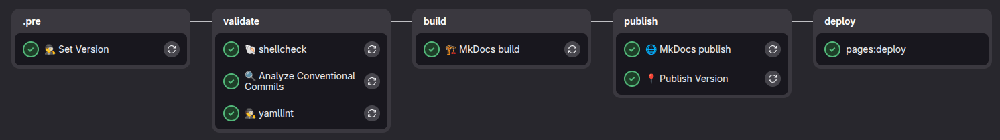

---
tags:
  - documentation
  - creative process
---

# Gitlab Creative Process Pipeline

The `.gitlab-ci.yml` file in this directory is an example pipeline for a repository that develops, versions, and publishes Eye of Discipline standards.

The pipeline separates three concerns:

- **version calculation and version artifact preparation** after a commit push or merge push,
- **MkDocs portal build and publication** for the calculated version,
- **release publication** through `semantic-release`.

## Assumptions

The pipeline assumes that the repository:

- uses Conventional Commits,
- publishes versions through `semantic-release`,
- contains MkDocs configuration,
- stores standards in the `standards/` directory,
- can push changes to the `gitlab-pages` branch,
- publishes the site from the `public/` directory.

The `bin/prepare_build` script prepares standards before documentation publication. Its place in the process is described in [Preparing Version Artifacts](../../../docs/creative_process.md#6-przygotowanie-artefaktow-wersji).

The `semantic-release` configuration is stored in:

```text
ci/gitlab/creative-process/.releaserc.cjs
```

Jobs copy this file to the working directory as `.releaserc.cjs`.

## Pipeline Variables

| Variable | Default value | Meaning |
| --- | --- | --- |
| `GIT_DEPTH` | `0` | fetches full history required by `semantic-release` |
| `RELEASE_CANDIDATE_VERSION` | calculated in `🕵 Set Version` | candidate version used by `bin/prepare_build` |
| `CI_COMMIT_TAG` | set by GitLab | release tag used when publishing documentation |
| `PAGES_BRANCH` | `gitlab-pages` | branch where `mike` maintains versioned documentation |
| `DISABLE_MKDOCS_2_WARNING` | `true` | disables the MkDocs 2 warning in the build image |

`🏗️ MkDocs build` publishes documentation for the version from `CI_COMMIT_TAG` or `RELEASE_CANDIDATE_VERSION`. If both values are empty, `mike` has no valid version to publish.

## Pipeline Structure

The pipeline consists of three stages:

| Stage | Job | Responsibility |
| --- | --- | --- |
| `prepare` | `🕵 Set Version` | runs `semantic-release` dry-run and writes `versioning.env` |
| `build` | `🏗️ MkDocs build` | publishes versioned documentation with `mike` and prepares the `public/` artifact |
| `publish` | `🌐 MkDocs publish` | passes the `public/` artifact to GitLab Pages |
| `publish` | `📍 Publish Version` | runs the real `semantic-release` and publishes the release |

## Example Pipeline



## Relationship Between Versioning and Publication

The versioning flow runs on a regular pipeline after a repository change:

- commit push or merge push starts `🕵 Set Version` and `📍 Publish Version`,
- `🕵 Set Version` runs `semantic-release --dry-run` to discover the next version and write it to `versioning.env`,
- `🏗️ MkDocs build` reads `versioning.env`, runs `bin/prepare_build`, and publishes the portal through `mike`,
- `🌐 MkDocs publish` exposes the `public/` artifact as GitLab Pages,
- `📍 Publish Version` runs `semantic-release`, which creates the release and tag.

Tag pipelines are handled differently:

- `🕵 Set Version` and `📍 Publish Version` are skipped for `CI_COMMIT_TAG`,
- documentation publication uses the version from the tag,
- `🏗️ MkDocs build` generates versioned documentation,
- `🌐 MkDocs publish` publishes the `public/` directory as GitLab Pages.

This keeps the version derived from commit history, while standards documentation is published as a concrete versioned artifact.

## `🕵 Set Version`

The job runs in the `prepare` stage and does not run for tag pipelines:

```yaml
rules:
  - if: '$CI_COMMIT_TAG'
    when: never
  - when: on_success
```

The job copies the release configuration:

```bash
cp ci/gitlab/creative-process/.releaserc.cjs .releaserc.cjs
```

Then it runs a dry-run:

```bash
semantic-release --dry-run
```

The `.releaserc.cjs` configuration writes release variables to `versioning.env`. The most important one is `RELEASE_CANDIDATE_VERSION`, later used by `bin/prepare_build` and `mike`.

## `📍 Publish Version`

The job runs in the `publish` stage and also does not run for tag pipelines.

It runs the actual release process:

```bash
semantic-release
```

`semantic-release` analyzes commits, calculates the version, publishes the release, and creates the tag. The tag can later start the pipeline responsible for publishing versioned documentation.

!!! warning

    Before using it, check the current [semantic-release](https://gitlab.com/dev.rachuna/artifacts/containers/semantic-release/-/releases) image version.

## `🏗️ MkDocs build`

The job runs in the `build` stage and prepares documentation published by GitLab Pages.

The job configures Git, fetches the `gitlab-pages` branch, and then uses `mike` to publish the version:

```bash
if [ -f ./bin/prepare_build ]; then
  chmod +x ./bin/prepare_build
  ./bin/prepare_build
fi

DOCS_VERSION="${CI_COMMIT_TAG:-${RELEASE_CANDIDATE_VERSION:-}}"

mike deploy "$DOCS_VERSION" latest \
  --push \
  --update-aliases \
  -b "$PAGES_BRANCH"
```

After deployment, the job sets the published version as the default:

```bash
mike set-default --push "$DOCS_VERSION" \
  -b "$PAGES_BRANCH"
```

At the end, the content of the `gitlab-pages` branch is packed into the `public/` directory, which becomes an artifact for the next job.

`bin/prepare_build` runs before `mike` publication because it prepares version-dependent files: standard metadata, verification job definitions, and other generated process artifacts.

!!! warning

    Before using it, check the current [mkdocs](https://gitlab.com/dev.rachuna/artifacts/containers/mkdocs/-/releases) image version.

## `🌐 MkDocs publish`

The job runs in the `publish` stage and depends on the artifact from `🏗️ MkDocs build`:

```yaml
needs:
  - job: 🏗️ MkDocs build
    artifacts: true
```

It publishes the `public/` directory as GitLab Pages:

```yaml
pages:
  publish: public
```

As a result, GitLab Pages serves standards documentation generated by MkDocs and versioned by `mike`.

`📍 Publish Version` waits for `🌐 MkDocs publish`, so the release is published after the portal has been prepared and exposed.

## Artifacts

The `🕵 Set Version` job writes:

```text
versioning.env
CHANGELOG.md
```

`versioning.env` is a `dotenv` report, so GitLab exposes the variables stored in it to subsequent jobs. In this pipeline, the most important variable is `RELEASE_CANDIDATE_VERSION`.

The `🏗️ MkDocs build` job writes:

```text
public/
```

The `public/` artifact is passed to `🌐 MkDocs publish`, which publishes it through GitLab Pages.

The `📍 Publish Version` job uses the same `.releaserc.cjs` configuration, but does not publish a separate artifact. Its result is a GitLab release and tag.
