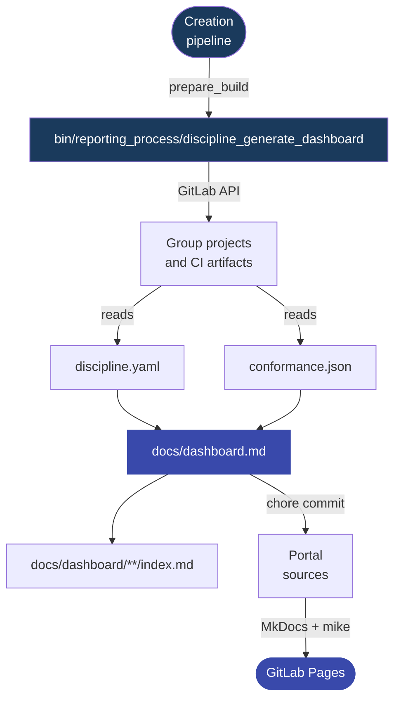

---
tags:
  - documentation
  - reporting process
  - dashboard
---

# Reporting Thread Idea

The documentation keeps a separate reporting thread because the dashboard is a separate topic for portal users. Technically, however, it is not a process equal to the creation and verification processes. It is one dashboard feed script connected to the main creation process.

Technically it works like this: the creation pipeline runs `bin/prepare_build`, and that calls the dashboard generator. If changes appear in `docs/dashboard.md` or in `docs/dashboard/**` subpages, `bin/commit_build_changes` commits them with:

```text
chore(standards): Assign versions to changed standards or update dashboard
```

Such a commit updates the portal sources, but it does not have to bump the discipline version. The dashboard is a view of the current project state, not a change to standards law.

The main rule is simple:

- the verification process creates the project's **QA result** in `conformance.json`,
- the dashboard generator creates a **portfolio view** in Markdown,
- the creation process publishes the **MkDocs portal** through GitLab Pages,
- a dashboard update is a **page change**, not a new standards version.



## 1. Data Source

The dashboard is based on data that was produced earlier in application repositories:

| Data | Source | Meaning |
| --- | --- | --- |
| `discipline.yaml` | application repository | declares the discipline version, attestations, and exceptions |
| `conformance.json` | application pipeline artifact | contains the discipline QA result |
| project metadata | GitLab API | makes it possible to build a portfolio view |

The generator does not run standard checks. If a project does not have `conformance.json`, the dashboard shows missing measurement, not compliance.

## 2. Dashboard Generation

In `bin/prepare_build`, the dashboard is generated as the first step:

```bash
bin/reporting_process/discipline_generate_dashboard
bin/creative_process/stamp_standard_metadata --version "$VERSION"
bin/creative_process/generate_checks_jobs
bin/commit_build_changes
```

The generator fetches projects from the GitLab group, checks for `discipline.yaml`, looks for the `conformance.json` artifact, and writes the result as Markdown rendered from Jinja2 templates.

Default outputs:

```text
docs/dashboard.md
docs/dashboard/{project_full_path}/index.md
```

## 3. Update Commit

After generating the dashboard, `bin/commit_build_changes` runs:

```bash
git add .
git reset -- bin/
```

This means that the automatic commit can include the generated dashboard, standard metadata, and verification jobs, but it does not include changes in the `bin/` directory.

Default commit message:

```text
chore(standards): Assign versions to changed standards or update dashboard
```

`chore` is intentional here. A dashboard update is a change to the published page, but it does not by itself change standards, checks, or the `discipline.yaml` contract.

## 4. Publishing through MkDocs

After the commit, the MkDocs pipeline builds the documentation portal. If the repository contains:

```text
docs/dashboard.md
docs/dashboard/**/index.md
```

MkDocs treats them as regular documentation pages. Then `mike` publishes versioned documentation to the GitLab Pages branch.

The final effect is the same as with a standard change: the user sees an updated portal. The difference is that a dashboard update does not have to create a new discipline version.

## 5. Dashboard Statuses

The dashboard shows the state of available data:

| Status | Meaning |
| --- | --- |
| `pass` | the project has a QA report and all required standards passed |
| `pass_with_waivers` | the project has non-compliance covered by active exceptions |
| `fail` | the project has non-compliance without an active exception |
| `error` | the QA report contains an aggregation error |
| `no_checks` | the QA report does not contain standard results |
| `no_report` | a declaration was found, but no `conformance.json` artifact was found |
| `no_discipline` | no `discipline.yaml` declaration was found |

`no_report` and `no_discipline` are dashboard view statuses. They are not standard verification results.

## 6. Responsibility Boundary

The dashboard is not a quality gate. It does not block the application pipeline and does not decide about deployment.

Its role is portfolio-oriented:

- it shows which projects are covered by the discipline,
- it shows where the latest QA result exists,
- it points to active exceptions,
- it reveals projects without measurement,
- it provides links to project and standard details.

!!! note "Key distinction"
    - The verification process measures project compliance.
    - The reporting thread shows available results in the dashboard.
    - The creation process runs the generator and publishes the dashboard as part of the MkDocs portal.

    That is why the "reporting process" is a documentation thread, while technically it is a dashboard feed connected to the creation process.
