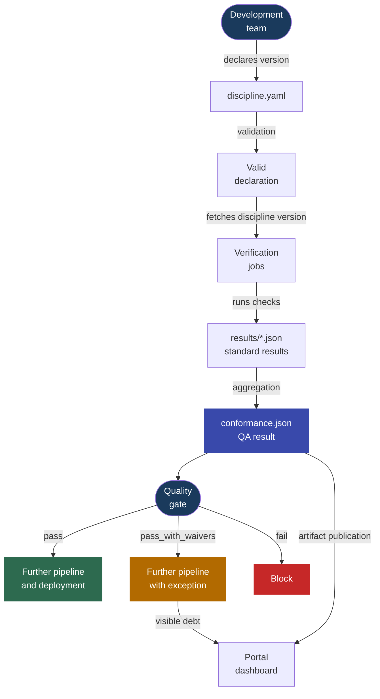

---
tags:
  - documentation
  - verification process
---

# Standards Verification Process Idea

The verification process describes how an application repository chooses a discipline version, runs measurements defined by standards, and makes a decision about the next pipeline steps. The development team does not copy standard logic into its repository. It declares intent in `discipline.yaml`, and the pipeline fetches the indicated discipline version and runs the verification jobs provided by it.

The result of the process is `conformance.json`: the discipline QA result for a specific pipeline. The report can control the quality gate and feed the MkDocs portal dashboard.

The most important rule of the process is simple:

- `discipline.yaml` describes **what** the project wants to comply with,
- the standard check describes **how** compliance will be measured,
- `conformance.json` says **what the measurement result is**,
- the quality gate decides **whether the pipeline can continue**.



## 1. Intent Declaration

The development team maintains this file in the application repository:

```text
discipline.yaml
```

A minimal declaration points to the discipline repository and selected standards version:

```yaml
apiVersion: eye-of-discipline.rachuna.dev/v1
kind: Discipline
metadata:
  name: my-service
spec:
  discipline:
    repository: dev.rachuna/eye-of-discipline
    ref: 1.0.0
```

`spec.discipline.ref` is the version pin. It should not change automatically because a discipline update can introduce new requirements or change the measurement method. A version change should be an explicit decision that goes through a Merge Request.

The declaration can also contain:

- `spec.attest` with information required by specific standards,
- `spec.exceptions` with temporary exceptions from indicated standards or checks.

### Manual Attestations

Not every requirement can be reliably checked based on files, artifacts, or APIs. One example is a requirement that a Merge Request was reviewed by another person when the GitLab edition in use does not expose this information in a way that can be automatically enforced.

In such a situation, the standard can require manual attestation stored in `spec.attest`. Attestation is an explicit confirmation by the development team that a specific requirement is being met:

```yaml
spec:
  attest:
    STD-REPO-002:
      r6: true
      r7: true
      r10: false
```

The structure inside `spec.attest` is defined by the specific standard. In the example above:

- `STD-REPO-002` points to the standard,
- `r6`, `r7`, and `r10` correspond to requirements described in its documentation,
- `true` confirms that the requirement is met,
- `false` means the team cannot confirm it.

The standard check reads attestation from `discipline.yaml` and includes it in the measurement result. The declaration validator only checks that `spec.attest` is a YAML object. The standard decides which keys it requires and how it interprets their values.

Attestation should go through review just like code. The person approving the change then confirms not only YAML correctness, but also the truth of the team's declaration.

!!! warning "Attestation is not an exception"
    Attestation means: **the requirement is met, but we cannot confirm it automatically**. An exception means: **the requirement is not met, but we temporarily accept this state**. These mechanisms should not be used interchangeably.

### Exceptions

An exception must have an owner, a reason, and an expiration date:

```yaml
spec:
  exceptions:
    - check: STD-REPO-002
      reason: "repository is being migrated"
      owner: platform-team
      expires: 2026-09-30
```

After the `expires` date, the exception is ignored. The standard is then measured normally, and non-compliance can block the pipeline.

!!! info "A declaration is not a result"
    `discipline.yaml` describes the team's intent and the measurement context. Adding this file alone does not mean that the project meets the standards. Compliance exists only after checks are run.

## 2. Declaration Validation

The first pipeline step is to check the `discipline.yaml` contract:

```bash
bin/verification_process/discipline_validate --file discipline.yaml
```

The validator checks, among other things:

- `apiVersion` and `kind`,
- `metadata.name`,
- `spec.discipline.repository`,
- `spec.discipline.ref`,
- the structure of optional `spec.attest` and `spec.exceptions`,
- required fields of each exception.

An error at this stage means a problem with the declaration, not non-compliance with a standard. The pipeline stops before fetching the discipline and running more expensive measurements.

Validation provides a stable reference point: the pipeline knows where to fetch the discipline from, which version to run, and how to interpret the team's additional data.

## 3. Running the Measurement

After successful validation, the pipeline fetches the discipline repository at the version indicated by `spec.discipline.ref`. Together with documentation, it receives checks and verification job definitions prepared in the creation process.

The file:

```text
ci/gitlab/verify/cheks_jobs.yml
```

is built from definitions:

```text
standards/**/.gitlab-ci.yml
```

The contract is:

```text
one standard = one job
```

Each job can have its own image, tools, variables, and dependencies. The common `.dyscypline` template provides process elements that must work the same way for all standards:

- fetching the indicated discipline version,
- handling an active exception,
- writing the result to `results/{STD_ID}.json`,
- a message with a link to the standard documentation.

The detailed contract for the template, job variables, exit codes, and standard report belongs in `bin/verification_process/standard_check_job.md`.

Example job definition:

```yaml
👁️ Eye discipline:STD-REPO-001:
  extends:
    - .dyscypline
  variables:
    STD_DOMAIN: repozytorium
    STD_ID: STD-REPO-001
    STD_CHECK_SCRIPT: /tmp/discipline/standards/$STD_DOMAIN/$STD_ID/bin/checks
  script:
    - bash "$STD_CHECK_SCRIPT"
```

The verification process does not need to know what is inside `bin/checks`. The standard is responsible for performing the correct measurement and returning a result the job can understand.

!!! info "The definition is created earlier, the measurement happens here"
    The creation process publishes job definitions together with the discipline version. The verification process runs them in the application repository. As a result, a measurement change is versioned together with the standard instead of being hardcoded in development teams' pipelines.

## 4. Writing Standard Results

Each job writes a separate artifact:

```text
results/{STD_ID}.json
```

Minimal positive result:

```json
{"key":"STD-REPO-001","status":"pass"}
```

Non-compliance:

```json
{"key":"STD-REPO-001","status":"fail"}
```

Active exception:

```json
{"key":"STD-REPO-002","status":"waived","exception":{"check":"STD-REPO-002","reason":"repository is being migrated","owner":"platform-team","expires":"2026-09-30"}}
```

The status of a single standard has one of three meanings:

| Status | Meaning |
| --- | --- |
| `pass` | the standard requirement has been met |
| `fail` | the requirement has not been met and there is no active exception |
| `waived` | the requirement has not been met, but an active exception exists |

The template checks the exception before running the check. A valid exception ends the job with code `101` and writes the `waived` result. An expired exception is skipped, so the check runs normally.

An exception does not turn the measurement result into a positive one. It preserves information about non-compliance, but lets it be handled as explicit and time-limited debt.

## 5. Aggregation and Quality Gate Decision

After standard jobs finish, the aggregator runs:

```bash
bin/verification_process/discipline_verify \
  --results-dir results \
  --discipline-file discipline.yaml \
  --output conformance.json
```

The script combines `results/*.json` and creates the `conformance.json` artifact. The report describes the state of a specific pipeline, so it is not committed to the application repository.

`conformance.json` contains:

- the final discipline status,
- a count summary of results,
- the list of standard checks,
- active exceptions,
- aggregation errors,
- pipeline metadata.

The status of the entire discipline is calculated from standard results:

| Status | Condition |
| --- | --- |
| `pass` | all checks have `pass` |
| `pass_with_waivers` | there is no `fail`, but at least one check has `waived` |
| `fail` | at least one check has `fail` |
| `error` | at least one report cannot be read correctly |
| `no_checks` | no `results/*.json` report was found |

The exit code turns the report result into a pipeline decision:

| Decision | Code | Effect |
| --- | --- | --- |
| compliance | `0` | the pipeline passes |
| non-compliance covered by an exception | `101` | the job is `allow_failure`, and the debt remains visible |
| non-compliance without an exception or measurement error | `1` | the pipeline is blocked |

`bin/verification_process/discipline_verify` also prints a verdict intended for the pipeline user:

- `Discipline quality gate: OK`,
- `Discipline quality gate: OK with exception`,
- `Discipline quality gate: BLOCKED`.

!!! warning "Code 101 must be allowed"
    The aggregation job must have `allow_failure` for code `101`. Without this configuration, GitLab will treat a controlled exception like a regular error and stop the pipeline despite the correct `pass_with_waivers` result.

## 6. Updating the Discipline Version

The development team updates the version pin through a Merge Request:

```yaml
spec:
  discipline:
    ref: 1.1.0
```

Review should confirm that the team understands the impact of the new version, and that required attestations and exceptions are complete and justified.

After merge, every following pipeline measures the project against the new version. The application repository does not change standards or their measurements. It only chooses the version of the product published by the discipline team.

## 7. Process Result

The final artifact is `conformance.json`. Example blocking summary:

```json
{
  "status": "fail",
  "summary": {
    "total": 3,
    "passed": 2,
    "waived": 0,
    "failed": 1,
    "errors": 0
  },
  "checks": [
    {"key": "STD-REPO-001", "status": "fail"},
    {"key": "STD-REPO-002", "status": "pass"},
    {"key": "STD-REPO-003", "status": "pass"}
  ]
}
```

In the log, the same result is presented as a decision:

```text
Discipline quality gate: BLOCKED. Non-compliance without a valid exception detected.
- STD-REPO-001: results/STD-REPO-001.json
discipline_verify exit code: 1
```

This result is a quality gate block. Non-compliance details are visible in the job log and in the `conformance.json` artifact.

!!! note "Key distinction"
    - `discipline.yaml` is a **declaration**: it indicates the discipline version and measurement context.
    - `results/{STD_ID}.json` is a **standard result**: it describes a single measurement.
    - `conformance.json` is the **discipline QA result**: it aggregates all measurements.
    - The exit code is a **quality gate decision**: it controls the next pipeline steps.

    Compliance cannot be declared or committed. Compliance must be measured.
