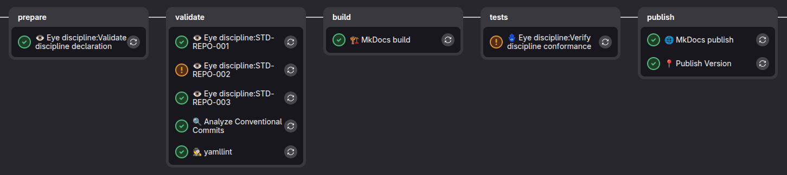

---
tags:
  - documentation
  - verification process
---

# GitLab CI as the Discipline Quality Gate

The file `ci/gitlab/verification-process/.gitlab-ci.yml` is the central discipline verification pipeline for GitLab CI. An application repository should not copy the whole process into itself. Its main CI pipeline should attach the process as an external include and treat it as a quality gate.

The most important integration element:

```yaml
include:
  - project: dev.rachuna/eye-of-discipline
    file: ci/gitlab/verification-process/.gitlab-ci.yml
    ref: main
```

This include adds the following to the application pipeline:

- validation of `discipline.yaml`,
- standard jobs generated from the discipline,
- aggregation of results into `conformance.json`,
- the quality gate decision.

## Place in the Main CI

The discipline verification pipeline is part of the application's main CI. It does not replace the build, unit tests, or deployment. It acts as an additional quality gate that answers the question:

```text
does the repository satisfy the standards of the declared discipline version?
```

Minimal usage example in an application repository:

```yaml
stages:
  - prepare
  - validate
  - tests
  - build
  - deployment

include:
  - project: dev.rachuna/eye-of-discipline
    file: ci/gitlab/verification-process/.gitlab-ci.yml
    ref: main
```

If the application has its own stages, they must include the stages used by the discipline pipeline:

| Stage | Role in the discipline process |
| --- | --- |
| `prepare` | validation of the `discipline.yaml` declaration |
| `validate` | standard jobs and individual measurements |
| `tests` | result aggregation and quality gate decision |

## Required Files in the Application Repository

The application repository must contain:

| File | Role |
| --- | --- |
| `discipline.yaml` | declaration of the discipline version, attestations, and waivers |

The application repository does not need to keep a local copy of the scripts:

- `bin/verification_process/discipline_validate`,
- `bin/verification_process/discipline_verify`.

The pipeline downloads them from the discipline repository indicated in `discipline.yaml`.

Minimal declaration:

```yaml
apiVersion: eye-of-discipline.rachuna.dev/v1
kind: Discipline
metadata:
  name: my-service
spec:
  discipline:
    repository: dev.rachuna/eye-of-discipline
    ref: main
```

`spec.discipline.repository` tells the pipeline where to download the discipline from. `spec.discipline.ref` tells it which discipline version or branch to use for measurement.

## Pipeline Variables

The central pipeline defines default values:

| Variable | Default value | Meaning |
| --- | --- | --- |
| `DISCIPLINE_FILE` | `discipline.yaml` | team declaration file |
| `CONFORMANCE_FILE` | `conformance.json` | final artifact with the discipline QA result |
| `EYE_DISCIPLINE_REPO` | `dev.rachuna/eye-of-discipline` | fallback discipline repository |
| `EYE_DISCIPLINE_REF` | `main` | fallback process ref |
| `EYE_DISCIPLINE_VALIDATE_SCRIPT_PATH` | `bin/verification_process/discipline_validate` | validator path in the discipline repository |
| `EYE_DISCIPLINE_VERIFY_SCRIPT_PATH` | `bin/verification_process/discipline_verify` | aggregator path in the discipline repository |

In practice, the most important values should come from `discipline.yaml`, because the application declaration determines the discipline version. The `EYE_DISCIPLINE_*` variables are technical fallbacks.

## Process Structure

The central pipeline consists of four parts:

| Element | Job / file | Responsibility |
| --- | --- | --- |
| standard job list | `ci/gitlab/verification-process/cheks_jobs.yml` | includes standard jobs published by the discipline |
| standard template | `.dyscypline` | downloads the discipline, handles waivers, and writes `results/{STD_ID}.json` |
| declaration validation | `👁️ Eye discipline:Validate discipline declaration` | checks the `discipline.yaml` contract |
| result aggregation | `🪬 Eye discipline:Verify discipline standards` | builds `conformance.json` and returns the quality gate code |

The pipeline starts by including standard jobs:

```yaml
include:
  local: ci/gitlab/verification-process/cheks_jobs.yml
```

In the version exported by the central include, this is part of the discipline repository. The application only attaches the main file `ci/gitlab/verification-process/.gitlab-ci.yml`.

## Example Pipeline



## Declaration Validation

Job:

```text
👁️ Eye discipline:Validate discipline declaration
```

runs in the `prepare` stage. It downloads the validator from the discipline repository:

```bash
encoded_project="${DISCIPLINE_REPOSITORY//\//%2F}"
encoded_path="${EYE_DISCIPLINE_VALIDATE_SCRIPT_PATH//\//%2F}"
validate_url="${CI_API_V4_URL}/projects/${encoded_project}/repository/files/${encoded_path}/raw?ref=${DISCIPLINE_REF}"
```

Then it runs:

```bash
./.discipline_validate --file "$DISCIPLINE_FILE"
```

The validator checks the declaration contract:

- file presence,
- `apiVersion`,
- `kind`,
- `metadata.name`,
- `spec.discipline.repository`,
- `spec.discipline.ref`,
- attestation structure,
- waiver structure.

A validation error means a declaration error, not a standard nonconformance.

## Standard Jobs

Each standard has its own job. Job definitions are generated in the discipline creation process and published in:

```text
ci/gitlab/verification-process/cheks_jobs.yml
```

The rule is:

```text
one standard = one job = one results/{STD_ID}.json report
```

A standard job extends `.dyscypline`, sets `STD_ID`, runs the appropriate `bin/checks`, and writes a report:

```json
{"key":"STD-REPO-001","status":"pass"}
```

If an active waiver exists for the standard, the report has the `waived` status:

```json
{"key":"STD-REPO-002","status":"waived","exception":{"check":"STD-REPO-002","reason":"repository is being migrated","owner":"platform-team","expires":"2026-09-30"}}
```

The full contract of the job, the `.dyscypline` template, variables, and the standard report is described in [Verification job definition](../standard_check_job.md).

## `.dyscypline` Template

The `.dyscypline` template is the shared base for standard jobs. It is responsible for:

- logging in to GitLab with `glab`,
- downloading the discipline repository indicated in `discipline.yaml`,
- copying `bin/` tools from the downloaded discipline version,
- checking whether an active waiver exists for `STD_ID`,
- writing the `results/{STD_ID}.json` report,
- exposing the `results/` artifact,
- printing a link to the standard documentation.

An active waiver ends the job with exit code `101`. The template allows:

```yaml
allow_failure:
  exit_codes:
    - 101
    - 120
```

Code `101` means an active waiver. Code `120` means a missing or unimplemented check. Both cases are reported, but they are not interpreted as a regular successful check.

If `expires` in the waiver is earlier than the current UTC date, the waiver is ignored and the check runs normally.

## Result Aggregation

Job:

```text
🪬 Eye discipline:Verify discipline standards
```

runs in the `tests` stage. It downloads the aggregator from the discipline repository:

```bash
encoded_project="${DISCIPLINE_REPOSITORY//\//%2F}"
encoded_path="${EYE_DISCIPLINE_VERIFY_SCRIPT_PATH//\//%2F}"
verify_url="${CI_API_V4_URL}/projects/${encoded_project}/repository/files/${encoded_path}/raw?ref=${DISCIPLINE_REF}"
```

Then it runs:

```bash
./.discipline_verify \
  --results-dir results \
  --discipline-file "$DISCIPLINE_FILE" \
  --output "$CONFORMANCE_FILE"
```

The script reads `results/*.json`, builds `conformance.json`, and prints a message intended for the pipeline recipient.

Possible final statuses:

| Status | Meaning |
| --- | --- |
| `pass` | all standards passed |
| `pass_with_waivers` | there are nonconformities, but all of them are covered by active waivers |
| `fail` | a nonconformity exists without an active waiver |
| `error` | some reports could not be read |
| `no_checks` | no `results/*.json` files were found |

## Quality Gate

The aggregation job is the quality gate for the main CI pipeline.

Exit codes have the following meaning:

| Code | Meaning | Effect |
| --- | --- | --- |
| `0` | everything is ok | the pipeline passes |
| `101` | not ok, but all nonconformities have active waivers | the job is `allow_failure`, the pipeline may pass |
| `1` | not ok and no waiver exists, or aggregation failed | the pipeline is blocked |

The pipeline has:

```yaml
allow_failure:
  exit_codes:
    - 101
```

This makes an active waiver visible in the log and in `conformance.json`, but it does not block the main pipeline. A missing waiver for a real nonconformity ends with code `1` and blocks the pipeline.

Example messages:

```text
✅ Discipline quality gate: OK. All required standards passed.
```

```text
⚠️ Discipline quality gate: OK with waiver. Nonconformities are covered by a valid waiver.
- STD-REPO-002: waiver until 2026-09-30; owner: platform-team; reason: repository is being migrated
```

```text
❌ Discipline quality gate: BLOCKED. Nonconformities without a valid waiver were detected.
- STD-REPO-003: results/STD-REPO-003.json
```

## Artifacts

Standard jobs write:

```text
results/
```

The aggregation job writes:

```text
conformance.json
```

`conformance.json` is a CI artifact. It should not be committed to the application repository because it describes the result of a specific pipeline run.

## Minimal Integration

Minimal integration in an application repository consists of two elements:

1. The `discipline.yaml` file.
2. The central pipeline include:

```yaml
include:
  - project: dev.rachuna/eye-of-discipline
    file: ci/gitlab/verification-process/.gitlab-ci.yml
    ref: main
```

The application repository does not need to move `cheks_jobs.yml`, `discipline_validate`, or `discipline_verify`. They are part of the versioned process in the discipline repository.
