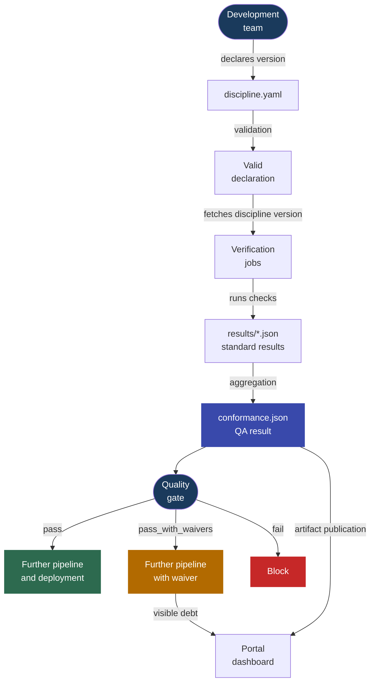

---
tags:
  - documentation
  - verification process
---

# Verification Process Concept for Standards Conformance

The verification process describes how an application repository selects a discipline version, runs measurements defined by standards, and decides whether the pipeline can continue. The development team does not copy standard logic into its own repository. It declares intent in `discipline.yaml`, and the pipeline fetches the selected discipline version and runs the verification jobs provided by that version.

The result of the process is `conformance.json`: the discipline QA result for a specific pipeline. The report can drive a quality gate and feed the MkDocs portal dashboard.

In practice, the process is attached to the application's main pipeline as a quality gate. For GitLab CI, the application repository uses the central include:

```yaml
include:
  - project: dev.rachuna/eye-of-discipline
    file: ci/gitlab/verification-process/.gitlab-ci.yml
    ref: feat/multi-language
```

This include provides declaration validation, standard jobs, and result aggregation. The application repository primarily needs to maintain `discipline.yaml`.

The core rule of the process is simple:

- `discipline.yaml` describes **what** the project wants to conform to,
- a standard check describes **how** conformance will be measured,
- `conformance.json` says **what the measurement result is**,
- the quality gate decides **whether the pipeline may continue**.



## 1. Declaration of Intent

The development team maintains the following file in the application repository:

```text
discipline.yaml
```

A minimal declaration points to the discipline repository and the selected standards version:

```yaml
apiVersion: eye-of-discipline.rachuna.dev/v1
kind: Discipline
metadata:
  name: my-service
spec:
  discipline:
    repository: dev.rachuna/eye-of-discipline
    ref: 1.0.0
```

`spec.discipline.ref` is a version pin. It should not change automatically, because a discipline update may introduce new requirements or change how existing requirements are measured. A version change should be an explicit decision that goes through a Merge Request.

The declaration may also contain:

- `spec.attest` with information required by specific standards,
- `spec.exceptions` with temporary waivers for selected standards or checks.

### Manual Attestations

Not every requirement can be verified reliably from files, artifacts, or APIs. One example is the requirement that a Merge Request was reviewed by another person when the GitLab edition in use does not expose that information in a way that can be enforced automatically.

In that case, a standard may require a manual attestation stored in `spec.attest`. An attestation is an explicit confirmation from the development team that a specific requirement is met:

```yaml
spec:
  attest:
    STD-REPO-002:
      r6: true
      r7: true
      r10: false
```

The structure inside `spec.attest` is defined by the specific standard. In the example above:

- `STD-REPO-002` identifies the standard,
- `r6`, `r7`, and `r10` map to requirements described in that standard's documentation,
- `true` confirms that the requirement is met,
- `false` means the team cannot confirm it.

The standard check reads the attestation from `discipline.yaml` and includes it in the measurement result. The declaration validator only checks that `spec.attest` is a YAML object. The standard decides which keys it requires and how their values are interpreted.

An attestation should go through review in the same way as code. The person approving the change then confirms not only YAML correctness, but also the truthfulness of the team's declaration.

!!! warning "An attestation is not a waiver"
    An attestation says: **the requirement is met, but we cannot prove it automatically**. A waiver says: **the requirement is not met, but we temporarily accept that state**. These mechanisms should not be used interchangeably.

### Waivers

A waiver must have an owner, a reason, and an expiration date:

```yaml
spec:
  exceptions:
    - check: STD-REPO-002
      reason: "repository is being migrated"
      owner: platform-team
      expires: 2026-09-30
```

After `expires`, the waiver is ignored. The standard is then measured normally, and a nonconformance may block the pipeline.

!!! info "A declaration is not a result"
    `discipline.yaml` describes the team's intent and the measurement context. Adding this file does not mean the project conforms to the standards. Conformance exists only after the checks have been executed.

## 2. Declaration Validation

The first pipeline step checks the `discipline.yaml` contract:

```bash
bin/verification_process/discipline_validate --file discipline.yaml
```

The validator checks, among other things:

- `apiVersion` and `kind`,
- `metadata.name`,
- `spec.discipline.repository`,
- `spec.discipline.ref`,
- the structure of optional `spec.attest` and `spec.exceptions`,
- required fields for each waiver.

An error at this stage means a declaration problem, not a standards nonconformance. The pipeline stops before fetching the discipline and running more expensive measurements.

Validation provides a stable reference point: the pipeline knows where to fetch the discipline from, which version to execute, and how to interpret additional team-provided data.

## 3. Running the Measurement

After successful validation, the pipeline fetches the discipline repository at the version selected by `spec.discipline.ref`. Together with the documentation, it receives checks and verification job definitions prepared by the creative process.

The file:

```text
ci/gitlab/verification-process/cheks_jobs.yml
```

is built from definitions stored in:

```text
standards/**/.gitlab-ci.yml
```

The contract is:

```text
one standard = one job = one results/{STD_ID}.json report
```

Each job may have its own image, tools, variables, and dependencies. The shared `.dyscypline` template provides the process elements that must behave the same way for all standards:

- fetching the selected discipline version,
- handling an active waiver,
- writing the result to `results/{STD_ID}.json`,
- printing a message with a link to the standard documentation.

The detailed contract for the template, job variables, exit codes, and standard report is described in [Verification Job Definition](standard_check_job.md).

The list of standard jobs is generated in the creative process by:

```bash
bin/creative_process/generate_checks_jobs
```

The generator reads `standards/**/.gitlab-ci.yml` and refreshes `ci/gitlab/verification-process/cheks_jobs.yml`. This makes the central verification pipeline publish the current measurement set for a given discipline version.

Example job definition:

```yaml
👁️ Eye discipline:STD-REPO-001:
  extends:
    - .dyscypline
  variables:
    STD_DOMAIN: repozytorium
    STD_ID: STD-REPO-001
    STD_CHECK_SCRIPT: /tmp/discipline/standards/$STD_DOMAIN/$STD_ID/bin/checks
  script:
    - bash "$STD_CHECK_SCRIPT"
```

The verification process does not need to know what is inside `bin/checks`. The standard is responsible for performing the correct measurement and returning a result that the job can understand.

!!! info "The definition is created earlier; the measurement happens here"
    The creative process publishes job definitions together with the discipline version. The verification process executes them in the application repository. This means measurement changes are versioned together with the standard, instead of being hardcoded into development team pipelines.

## 4. Writing Standard Results

Each job writes a separate artifact:

```text
results/{STD_ID}.json
```

Minimal positive result:

```json
{"key":"STD-REPO-001","status":"pass"}
```

Nonconformance:

```json
{"key":"STD-REPO-001","status":"fail"}
```

Active waiver:

```json
{"key":"STD-REPO-002","status":"waived","exception":{"check":"STD-REPO-002","reason":"repository is being migrated","owner":"platform-team","expires":"2026-09-30"}}
```

The status of a single standard has one of three meanings:

| Status | Meaning |
| --- | --- |
| `pass` | the standard requirement has been met |
| `fail` | the requirement has not been met and there is no active waiver |
| `waived` | the requirement has not been met, but an active waiver exists |

The template checks for a waiver before running the check. A valid waiver ends the job with code `101` and writes a `waived` result. An expired waiver is skipped, so the check runs normally.

A waiver does not turn the measurement into a positive result. It preserves information about the nonconformance, but allows it to be handled as explicit, time-limited debt.

## 5. Aggregation and Quality Gate Decision

After the standard jobs finish, the aggregator runs. In GitLab CI this is handled by the job:

```text
🪬 Eye discipline:Verify discipline standards
```

The job fetches `bin/verification_process/discipline_verify` from the discipline repository and runs:

```bash
bin/verification_process/discipline_verify \
  --results-dir results \
  --discipline-file discipline.yaml \
  --output conformance.json
```

The script combines `results/*.json` and creates the `conformance.json` artifact. The report describes the state of a specific pipeline, so it is not committed to the application repository.

`conformance.json` contains:

- the final discipline status,
- a result count summary,
- the list of standard checks,
- active waivers,
- aggregation errors,
- pipeline metadata.

The whole discipline status is calculated from standard results:

| Status | Condition |
| --- | --- |
| `pass` | all checks have `pass` |
| `pass_with_waivers` | there is no `fail`, but at least one check has `waived` |
| `fail` | at least one check has `fail` |
| `error` | at least one report cannot be read correctly |
| `no_checks` | no `results/*.json` report was found |

The exit code turns the report result into a pipeline decision:

| Decision | Code | Effect |
| --- | --- | --- |
| conformance | `0` | the pipeline passes |
| nonconformance covered by a waiver | `101` | the job is `allow_failure`, and the debt remains visible |
| nonconformance without a waiver or measurement error | `1` | the pipeline is blocked |

`bin/verification_process/discipline_verify` also prints a verdict for the pipeline consumer:

- `Discipline quality gate: OK`,
- `Discipline quality gate: OK with waiver`,
- `Discipline quality gate: BLOCKED`.

!!! warning "Code 101 must be allowed"
    In GitLab CI, the aggregation job must have `allow_failure` for code `101`. Without that configuration, GitLab treats a controlled waiver as a regular error and stops the pipeline even though the result is correctly classified as `pass_with_waivers`.

## 6. Updating the Discipline Version

The development team updates the version pin through a Merge Request:

```yaml
spec:
  discipline:
    ref: 1.1.0
```

The review should confirm that the team understands the impact of the new version, and that required attestations and waivers are complete and justified.

After the merge, every following pipeline measures the project against the new version. The application repository does not change standards or their measurements. It only selects the version of the product published by the discipline team.

## 7. Process Result

The final artifact is `conformance.json`. Example block summary:

```json
{
  "status": "fail",
  "summary": {
    "total": 3,
    "passed": 2,
    "waived": 0,
    "failed": 1,
    "errors": 0
  },
  "checks": [
    {"key": "STD-REPO-001", "status": "fail"},
    {"key": "STD-REPO-002", "status": "pass"},
    {"key": "STD-REPO-003", "status": "pass"}
  ]
}
```

The same result is presented in the job log as a decision:

```text
Discipline quality gate: BLOCKED. Nonconformances without a valid waiver were detected.
- STD-REPO-001: results/STD-REPO-001.json
discipline_verify exit code: 1
```

This result blocks the quality gate. Nonconformance details are visible in the job log and in the `conformance.json` artifact.

!!! note "Key distinction"
    - `discipline.yaml` is a **declaration**: it points to the discipline version and measurement context.
    - `results/{STD_ID}.json` is a **standard result**: it describes a single measurement.
    - `conformance.json` is the **discipline QA result**: it aggregates all measurements.
    - The exit code is the **quality gate decision**: it controls the further pipeline flow.

    Conformance cannot be declared or committed. Conformance must be measured.
