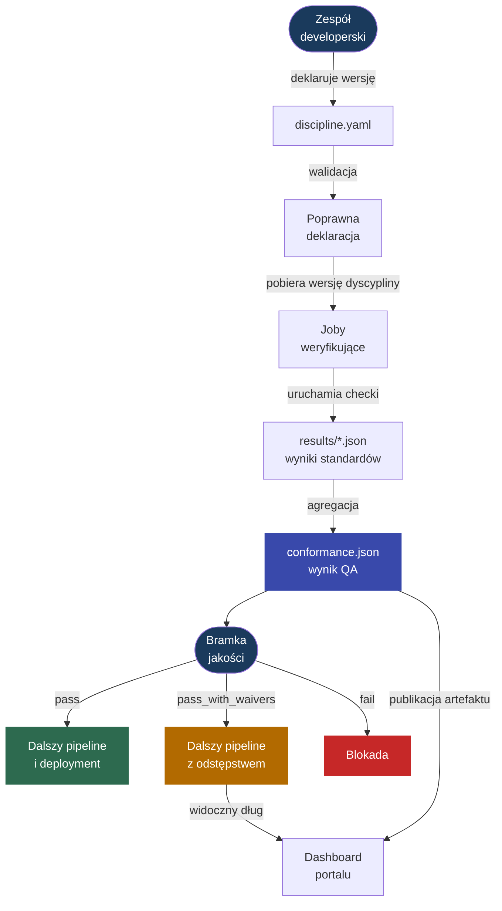

---
tags:
  - documentation
  - verification process
---

# Idea procesu weryfikującego stosowanie standardów

Proces weryfikujący opisuje, jak repozytorium aplikacji wybiera wersję dyscypliny, uruchamia pomiary zdefiniowane przez standardy i podejmuje decyzję o dalszym przebiegu pipeline'u. Zespół developerski nie kopiuje logiki standardów do swojego repozytorium. Deklaruje intencję w `discipline.yaml`, a pipeline pobiera wskazaną wersję dyscypliny i wykonuje dostarczone przez nią joby weryfikujące.

Efektem procesu jest `conformance.json`: wynik QA dyscypliny dla konkretnego pipeline'u. Raport może sterować bramką jakości oraz zasilać dashboard portalu MkDocs.

W praktyce proces jest podpinany do głównego pipeline'u aplikacji jako bramka jakości. Dla GitLab CI repozytorium aplikacji używa centralnego include:

```yaml
include:
  - project: dev.rachuna/eye-of-discipline
    file: ci/gitlab/verification-process/.gitlab-ci.yml
    ref: feat/multi-language
```

Ten include dostarcza walidację deklaracji, joby standardów oraz agregację wyniku. Repozytorium aplikacji musi utrzymywać przede wszystkim `discipline.yaml`.

Najważniejsza zasada procesu jest prosta:

- `discipline.yaml` opisuje, **z czym** projekt chce być zgodny,
- check standardu opisuje, **jak** zgodność zostanie zmierzona,
- `conformance.json` mówi, **jaki jest wynik** pomiaru,
- bramka jakości decyduje, **czy pipeline może przejść dalej**.



## 1. Deklaracja intencji

Zespół developerski utrzymuje w repozytorium aplikacji plik:

```text
discipline.yaml
```

Minimalna deklaracja wskazuje repozytorium dyscypliny i wybraną wersję standardów:

```yaml
apiVersion: eye-of-discipline.rachuna.dev/v1
kind: Discipline
metadata:
  name: my-service
spec:
  discipline:
    repository: dev.rachuna/eye-of-discipline
    ref: 1.0.0
```

`spec.discipline.ref` jest pinem wersji. Nie powinien zmieniać się automatycznie, ponieważ aktualizacja dyscypliny może wprowadzić nowe wymagania albo zmienić sposób pomiaru. Zmiana wersji powinna być jawną decyzją przechodzącą przez Merge Request.

Deklaracja może zawierać również:

- `spec.attest` z informacjami wymaganymi przez konkretne standardy,
- `spec.exceptions` z czasowymi odstępstwami od wskazanych standardów albo checków.

### Atestacje manualne

Nie każde wymaganie można wiarygodnie sprawdzić na podstawie plików, artefaktów albo API. Przykładem jest wymaganie, że Merge Request został przejrzany przez inną osobę, jeżeli używana edycja GitLaba nie udostępnia tej informacji w sposób możliwy do automatycznego wymuszenia.

W takiej sytuacji standard może wymagać atestacji manualnej zapisanej w `spec.attest`. Atestacja jest jawnym potwierdzeniem zespołu developerskiego, że określone wymaganie jest spełniane:

```yaml
spec:
  attest:
    STD-REPO-002:
      r6: true
      r7: true
      r10: false
```

Struktura wewnątrz `spec.attest` jest definiowana przez konkretny standard. W powyższym przykładzie:

- `STD-REPO-002` wskazuje standard,
- `r6`, `r7` i `r10` odpowiadają wymaganiom opisanym w jego dokumentacji,
- `true` potwierdza spełnienie wymagania,
- `false` oznacza, że zespół nie może go potwierdzić.

Check standardu odczytuje atestację z `discipline.yaml` i uwzględnia ją w wyniku pomiaru. Walidator deklaracji sprawdza jedynie, czy `spec.attest` jest obiektem YAML. To standard decyduje, których kluczy wymaga i jak interpretuje ich wartości.

Atestacja powinna przechodzić review tak samo jak kod. Osoba zatwierdzająca zmianę potwierdza wtedy nie tylko poprawność YAML-a, ale również prawdziwość deklaracji zespołu.

!!! warning "Atestacja nie jest odstępstwem"
    Atestacja mówi: **wymaganie jest spełnione, ale nie potrafimy potwierdzić tego automatycznie**. Odstępstwo mówi: **wymaganie nie jest spełnione, ale czasowo akceptujemy ten stan**. Tych mechanizmów nie należy używać zamiennie.

### Odstępstwa

Odstępstwo musi mieć właściciela, powód i datę wygaśnięcia:

```yaml
spec:
  exceptions:
    - check: STD-REPO-002
      reason: "repozytorium jest w trakcie migracji"
      owner: platform-team
      expires: 2026-09-30
```

Po terminie `expires` odstępstwo jest ignorowane. Standard zostaje wtedy zmierzony normalnie, a niezgodność może zablokować pipeline.

!!! info "Deklaracja nie jest wynikiem"
    `discipline.yaml` opisuje intencję zespołu i kontekst pomiaru. Samo dodanie tego pliku nie oznacza, że projekt spełnia standardy. Zgodność powstaje dopiero po wykonaniu checków.

## 2. Walidacja deklaracji

Pierwszym krokiem pipeline'u jest sprawdzenie kontraktu `discipline.yaml`:

```bash
bin/verification_process/discipline_validate --file discipline.yaml
```

Walidator sprawdza między innymi:

- `apiVersion` i `kind`,
- `metadata.name`,
- `spec.discipline.repository`,
- `spec.discipline.ref`,
- strukturę opcjonalnych `spec.attest` i `spec.exceptions`,
- wymagane pola każdego odstępstwa.

Błąd na tym etapie oznacza problem z deklaracją, a nie niezgodność ze standardem. Pipeline zatrzymuje się przed pobraniem dyscypliny i uruchomieniem kosztowniejszych pomiarów.

Walidacja zapewnia stabilny punkt odniesienia: pipeline wie, skąd pobrać dyscyplinę, którą wersję wykonać oraz jak interpretować dodatkowe dane zespołu.

## 3. Uruchomienie pomiaru

Po poprawnej walidacji pipeline pobiera repozytorium dyscypliny w wersji wskazanej przez `spec.discipline.ref`. Razem z dokumentacją otrzymuje checki i definicje jobów weryfikujących przygotowane w procesie wytwórczym.

Plik:

```text
ci/gitlab/verification-process/cheks_jobs.yml
```

jest zbudowany z definicji:

```text
standards/**/.gitlab-ci.yml
```

Obowiązuje kontrakt:

```text
jeden standard = jeden job = jeden raport results/{STD_ID}.json
```

Każdy job może mieć własny obraz, narzędzia, zmienne i zależności. Wspólny template `.dyscypline` zapewnia elementy procesu, które muszą działać tak samo dla wszystkich standardów:

- pobranie wskazanej wersji dyscypliny,
- obsługę aktywnego odstępstwa,
- zapis wyniku do `results/{STD_ID}.json`,
- komunikat z linkiem do dokumentacji standardu.

Szczegółowy kontrakt template'u, zmiennych joba, kodów wyjścia i raportu standardu opisuje dokument [Definicja joba weryfikującego](standard_check_job.md).

Lista jobów standardów jest generowana w procesie wytwórczym przez:

```bash
bin/creative_process/generate_checks_jobs
```

Generator czyta `standards/**/.gitlab-ci.yml` i odświeża `ci/gitlab/verification-process/cheks_jobs.yml`. Dzięki temu centralny pipeline weryfikacji zawsze publikuje aktualny zestaw pomiarów dla danej wersji dyscypliny.

Przykładowa definicja joba:

```yaml
👁️ Eye discipline:STD-REPO-001:
  extends:
    - .dyscypline
  variables:
    STD_DOMAIN: repozytorium
    STD_ID: STD-REPO-001
    STD_CHECK_SCRIPT: /tmp/discipline/standards/$STD_DOMAIN/$STD_ID/bin/checks
  script:
    - bash "$STD_CHECK_SCRIPT"
```

Proces weryfikujący nie musi wiedzieć, co znajduje się w `bin/checks`. Odpowiedzialnością standardu jest wykonanie właściwego pomiaru i zwrócenie wyniku zrozumiałego dla joba.

!!! info "Definicja powstaje wcześniej, pomiar odbywa się tutaj"
    Proces wytwórczy publikuje definicje jobów razem z wersją dyscypliny. Proces weryfikujący wykonuje je w repozytorium aplikacji. Dzięki temu zmiana pomiaru jest wersjonowana razem ze standardem, a nie zaszyta na stałe w pipeline'ach zespołów developerskich.

## 4. Zapis wyników standardów

Każdy job zapisuje osobny artefakt:

```text
results/{STD_ID}.json
```

Minimalny wynik pozytywny:

```json
{"key":"STD-REPO-001","status":"pass"}
```

Niezgodność:

```json
{"key":"STD-REPO-001","status":"fail"}
```

Aktywne odstępstwo:

```json
{"key":"STD-REPO-002","status":"waived","exception":{"check":"STD-REPO-002","reason":"repozytorium jest w trakcie migracji","owner":"platform-team","expires":"2026-09-30"}}
```

Status pojedynczego standardu ma jedno z trzech znaczeń:

| Status | Znaczenie |
| --- | --- |
| `pass` | wymaganie standardu zostało spełnione |
| `fail` | wymaganie nie zostało spełnione i nie ma aktywnego odstępstwa |
| `waived` | wymaganie nie zostało spełnione, ale istnieje aktywne odstępstwo |

Template sprawdza odstępstwo przed uruchomieniem checka. Ważne odstępstwo kończy job kodem `101` i zapisuje wynik `waived`. Odstępstwo wygasłe jest pomijane, więc check wykonuje się normalnie.

Odstępstwo nie zmienia wyniku pomiaru na pozytywny. Zachowuje informację o niezgodności, ale pozwala obsłużyć ją jako jawny i ograniczony w czasie dług.

## 5. Agregacja i decyzja bramki jakości

Po zakończeniu jobów standardów uruchamiany jest agregator. W GitLab CI odpowiada za to job:

```text
🪬 Eye discipline:Verify discipline standards
```

Job pobiera `bin/verification_process/discipline_verify` z repozytorium dyscypliny i uruchamia:

```bash
bin/verification_process/discipline_verify \
  --results-dir results \
  --discipline-file discipline.yaml \
  --output conformance.json
```

Skrypt łączy `results/*.json` i tworzy artefakt `conformance.json`. Raport opisuje stan konkretnego pipeline'u, dlatego nie jest commitowany do repozytorium aplikacji.

`conformance.json` zawiera:

- końcowy status dyscypliny,
- podsumowanie liczby wyników,
- listę checków standardów,
- aktywne odstępstwa,
- błędy agregacji,
- metadane pipeline'u.

Status całej dyscypliny jest liczony z wyników standardów:

| Status | Warunek |
| --- | --- |
| `pass` | wszystkie checki mają `pass` |
| `pass_with_waivers` | nie ma `fail`, ale co najmniej jeden check ma `waived` |
| `fail` | co najmniej jeden check ma `fail` |
| `error` | co najmniej jednego raportu nie można poprawnie odczytać |
| `no_checks` | nie znaleziono żadnego raportu `results/*.json` |

Kod wyjścia zamienia wynik raportu w decyzję pipeline'u:

| Decyzja | Kod | Skutek |
| --- | --- | --- |
| zgodność | `0` | pipeline przechodzi |
| niezgodność objęta odstępstwem | `101` | job jest `allow_failure`, a dług pozostaje widoczny |
| niezgodność bez odstępstwa albo błąd pomiaru | `1` | pipeline zostaje zablokowany |

`bin/verification_process/discipline_verify` wypisuje również werdykt przeznaczony dla odbiorcy pipeline'u:

- `Bramka jakości dyscypliny: OK`,
- `Bramka jakości dyscypliny: OK z odstępstwem`,
- `Bramka jakości dyscypliny: BLOKADA`.

!!! warning "Kod 101 musi być dozwolony"
    W GitLab CI job agregujący musi mieć `allow_failure` dla kodu `101`. Bez tej konfiguracji GitLab potraktuje kontrolowane odstępstwo jak zwykły błąd i zatrzyma pipeline mimo poprawnego wyniku `pass_with_waivers`.

## 6. Aktualizacja wersji dyscypliny

Zespół developerski aktualizuje pin wersji przez Merge Request:

```yaml
spec:
  discipline:
    ref: 1.1.0
```

Review powinien potwierdzić, że zespół rozumie wpływ nowej wersji, a wymagane atestacje i odstępstwa są kompletne oraz uzasadnione.

Po merge'u każdy kolejny pipeline mierzy projekt względem nowej wersji. Repozytorium aplikacji nie zmienia standardów ani ich pomiarów. Wybiera jedynie wersję produktu opublikowanego przez zespół dyscypliny.

## 7. Wynik procesu

Końcowym artefaktem jest `conformance.json`. Przykładowe podsumowanie blokady:

```json
{
  "status": "fail",
  "summary": {
    "total": 3,
    "passed": 2,
    "waived": 0,
    "failed": 1,
    "errors": 0
  },
  "checks": [
    {"key": "STD-REPO-001", "status": "fail"},
    {"key": "STD-REPO-002", "status": "pass"},
    {"key": "STD-REPO-003", "status": "pass"}
  ]
}
```

W logu ten sam wynik jest przedstawiony w formie decyzji:

```text
Bramka jakości dyscypliny: BLOKADA. Wykryto niezgodności bez ważnego odstępstwa.
- STD-REPO-001: results/STD-REPO-001.json
discipline_verify exit code: 1
```

Taki wynik jest blokadą bramki jakości. Szczegóły niezgodności są widoczne w logu joba oraz w artefakcie `conformance.json`.

!!! note "Kluczowe rozróżnienie"
    - `discipline.yaml` jest **deklaracją**: wskazuje wersję dyscypliny i kontekst pomiaru.
    - `results/{STD_ID}.json` jest **wynikiem standardu**: opisuje pojedynczy pomiar.
    - `conformance.json` jest **wynikiem QA dyscypliny**: agreguje wszystkie pomiary.
    - Kod wyjścia jest **decyzją bramki jakości**: steruje dalszym przebiegiem pipeline'u.

    Zgodności nie da się zadeklarować ani zacommitować. Zgodność musi zostać zmierzona.
