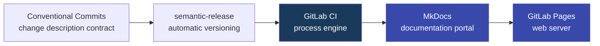
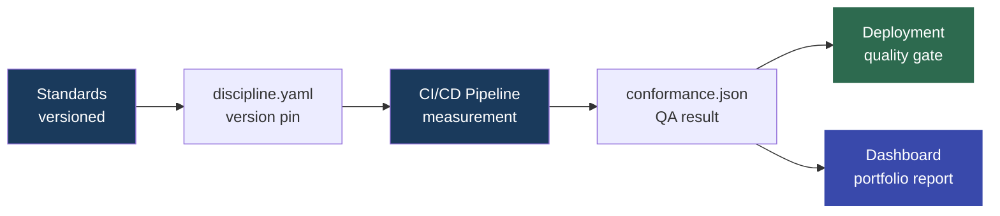

#  Eye of Discipline

**Eye of Discipline** organizes software development standards and transforms them into a versioned, measurable product. A standard is no longer just a wiki page: it has a requirements description, version, measurement method, and a report showing which repositories actually comply with it.

The problem is straightforward: organizations have standards like `branching`, `code review`, `security`, or `release process`, but usually don't know which projects actually follow them. Audits are manual, costly, and quickly become outdated.

**Eye of Discipline** solves this through three separate responsibilities:

- `discipline team` creates and publishes versioned standards,
- `development team` declares the discipline version in `discipline.yaml`,
- `CI/CD pipeline` measures compliance and records the result in `conformance.json`.

If a project does not meet the standard, the quality gate can block the pipeline. If the organization allows temporary deviation, it must be explicit, have an owner, reason, and expiration date.

Key concepts and responsibilities are collected in the document [Glossary and Roles](docs/glossary.md).

## Architecture

The presentation layer is a documentation portal generated by [MkDocs](https://squidfunk.github.io/mkdocs-material/setup/setting-up-versioning/). Published documentation is exposed as GitLab Pages, a static web server for standards, processes, and the dashboard.

The process engine is GitLab CI. Pipelines are responsible for preparing standards, publishing documentation, running checks in application repositories, and generating the dashboard.

Discipline versioning is automated by [semantic-release](https://semantic-release.gitbook.io/semantic-release?q=gitlab). `semantic-release` calculates the next version based on commit history, so the process is tightly coupled with the [Conventional Commits](https://www.conventionalcommits.org/en/v1.0.0/) standard.

## How does it work?

The system consists of four processes:

| Process | Owner | Result |
| --- | --- | --- |
| [Creative](docs/creative_process.md) | Discipline team | versioned standards and documentation |
| [Declaration](docs/verification_process.md#1-declaration-of-intent) | Development team | `discipline.yaml` in application repository |
| [Verification](docs/verification_process.md#3-running-the-measurement) | Application CI/CD | `conformance.json` and quality gate decision |
| [Reporting](docs/reporting_process.md) | Scheduler / central pipeline | discipline status dashboard across projects |

## What does the pipeline measure?

The pipeline does not evaluate the project in general. It measures specific requirements described in the standards.

Example: if a standard says the repository must have a protected `main` branch, the check verifies exactly this condition and returns a `pass` or `fail` result.

How the condition is verified depends on the standard. The standard author implements the measurement logic in a script `bin/checks`: it can check files, configuration, GitLab API, attestations in `discipline.yaml`, results from another tool, or any other signal needed to determine compliance.

The process contract is intentionally simple: the standard itself decides how it measures the requirement, but must return a result understandable to the pipeline.

The result of a single standard is:

- `pass` — the requirement is met,
- `fail` — the requirement is not met,
- `waived` — the requirement is not met, but has an active waiver.

The aggregator collects results from all standards and records a single `conformance.json` report.
