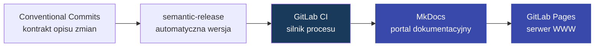
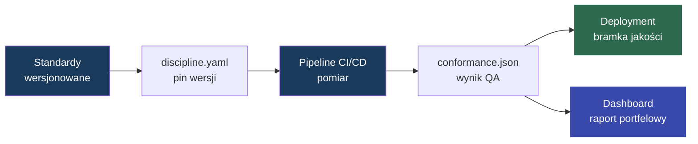

#  Eye of Discipline

**Eye of Discipline** porządkuje standardy wytwarzania oprogramowania i zamienia je w wersjonowany, mierzalny produkt. Standard nie jest już tylko stroną w wiki: ma opis wymagań, wersję, sposób pomiaru oraz raport pokazujący, które repozytoria rzeczywiście go spełniają.

Problem jest prosty: organizacje mają standardy takie jak `branching`, `code review`, `security` czy `release process`, ale zwykle nie wiedzą, które projekty faktycznie ich przestrzegają. Audyt jest ręczny, kosztowny i szybko traci aktualność.

**Eye of Discipline** rozwiązuje to przez trzy rozdzielone odpowiedzialności:

- `zespół dyscypliny` tworzy i publikuje wersjonowane standardy,
- `zespół developerski` deklaruje wersję dyscypliny w `discipline.yaml`,
- `pipeline CI/CD` mierzy zgodność i zapisuje wynik w `conformance.json`.

Jeżeli projekt nie spełnia standardu, bramka jakości może zablokować pipeline. Jeżeli organizacja dopuszcza czasowe odstępstwo, musi ono być jawne, mieć właściciela, powód i datę wygaśnięcia.

Kluczowe pojęcia i odpowiedzialności są zebrane w dokumencie [Słownik pojęć i role](docs/glossary.md).

## Architektura

Warstwą prezentacji jest portal dokumentacyjny generowany przez [MkDocs](https://squidfunk.github.io/mkdocs-material/setup/setting-up-versioning/). Opublikowana dokumentacja jest wystawiana jako GitLab Pages, czyli statyczny serwer WWW dla standardów, procesów i dashboardu.

Silnikiem procesu jest GitLab CI. Pipeline'y odpowiadają za przygotowanie standardów, publikację dokumentacji, uruchamianie checków w repozytoriach aplikacji oraz generowanie dashboardu.

Wersjonowanie dyscypliny jest automatyzowane przez [semantic-release](https://semantic-release.gitbook.io/semantic-release?q=gitlab). `semantic-release` wylicza kolejną wersję na podstawie historii commitów, dlatego proces jest ściśle powiązany ze standardem [Conventional Commits](https://www.conventionalcommits.org/en/v1.0.0/).

## Jak to działa?

System składa się z czterech procesów:

| Proces | Kto | Efekt |
| --- | --- | --- |
| [Wytwórczy](docs/creative_process.md) | Zespół dyscypliny | wersjonowane standardy i dokumentacja |
| [Deklaracji](docs/verification_process.md#1-deklaracja-intencji) | Zespół developerski | `discipline.yaml` w repozytorium aplikacji |
| [Weryfikacji](docs/verification_process.md#3-uruchomienie-pomiaru) | CI/CD aplikacji | `conformance.json` i decyzja bramki jakości |
| [Raportowania](docs/reporting_process.md) | Scheduler / centralny pipeline | dashboard stanu dyscypliny w projektach |

## Co mierzy pipeline?

Pipeline nie ocenia projektu ogólnie. Mierzy konkretne wymagania opisane w standardach.

Przykład: jeżeli standard mówi, że repozytorium musi mieć chroniony branch `main`, to check sprawdza właśnie ten warunek i zwraca wynik `pass` albo `fail`.

To, jak warunek zostanie sprawdzony, zależy od standardu. Autor standardu implementuje logikę pomiaru w skrypcie `bin/checks`: może sprawdzać pliki, konfigurację, GitLab API, atestacje w `discipline.yaml`, wynik innego narzędzia albo dowolny inny sygnał potrzebny do stwierdzenia zgodności.

Kontrakt procesu jest celowo prosty: standard sam decyduje, jak mierzy wymaganie, ale musi zwrócić wynik zrozumiały dla pipeline'u.

Wynik pojedynczego standardu to:

- `pass` — wymaganie jest spełnione,
- `fail` — wymaganie nie jest spełnione,
- `waived` — wymaganie nie jest spełnione, ale ma aktywne odstępstwo.

Agregator zbiera wyniki wszystkich standardów i zapisuje jeden raport `conformance.json`.
